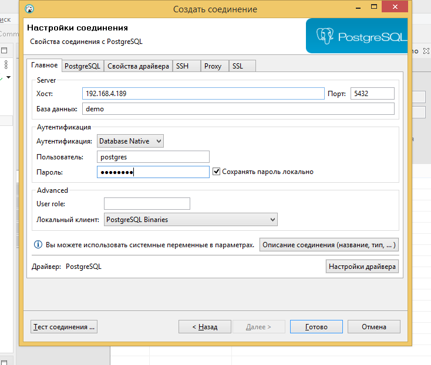
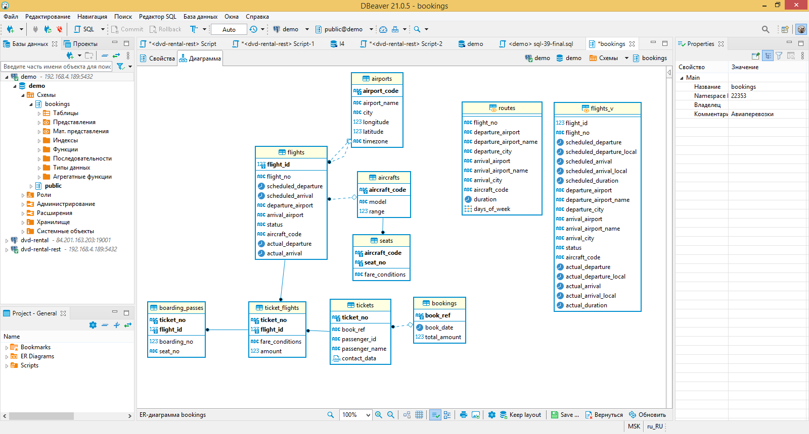

# Итоговая работа 

## В работе использовался локальный тип подключения.

[Вывод обработки sql файла](sql_output.txt)

## Скриншот ER-диаграммы из DBeaver`a согласно Вашего подключения.

##Краткое описание БД - из каких таблиц и представлений состоит.

Таблицы:

1. aircrafts
   
1. airports
   
1. boarding_passes
   
1. bookings
   
1. flights
   
1. seats
   
1. ticket_flights
   
1. tickets

Представления:

1. flights_v

Мат.представления:

1. routes

##Развернутый анализ БД - описание таблиц, логики, связей и бизнес области (частично можно взять из описания базы данных, оформленной в виде анализа базы данных). Бизнес задачи, которые можно решить, используя БД.

Основной сущностью является бронирование (bookings).

В одно бронирование можно включить несколько пассажиров, каждому из которых
выписывается отдельный билет (tickets). Билет имеет уникальный номер и содержит
информацию о пассажире. Как таковой пассажир не является отдельной сущностью. Как имя,
так и номер документа пассажира могут меняться с течением времени, так что невозможно
однозначно найти все билеты одного человека; для простоты можно считать, что все
пассажиры уникальны.

Билет включает один или несколько перелетов (ticket_flights). Несколько перелетов могут
включаться в билет в случаях, когда нет нет прямого рейса, соединяющего пункты
отправления и назначения (полет с пересадками), либо когда билет взят «туда и обратно».
В схеме данных нет жесткого ограничения, но предполагается, что все билеты в одном
бронировании имеют одинаковый набор перелетов.

Каждый рейс (flights) следует из одного аэропорта (airports) в другой. Рейсы с одним
номером имеют одинаковые пункты вылета и назначения, но будут отличаться датой
отправления.

При регистрации на рейс пассажиру выдается посадочный талон (boarding_passes), в котором
указано место в самолете. Пассажир может зарегистрироваться только на тот рейс, который
есть у него в билете. Комбинация рейса и места в самолете должна быть уникальной, чтобы
не допустить выдачу двух посадочных талонов на одно место.

Количество мест (seats) в самолете и их распределение по классам обслуживания зависит
от модели самолета (aircrafts), выполняющего рейс. Предполагается, что каждая модель
самолета имеет только одну компоновку салона. Схема данных не контролирует, что места
в посадочных талонах соответствуют имеющимся в самолете (такая проверка может быть
сделана с использованием табличных триггеров или в приложении).

##Список SQL запросов из приложения №2 с описанием логики их выполнения.
